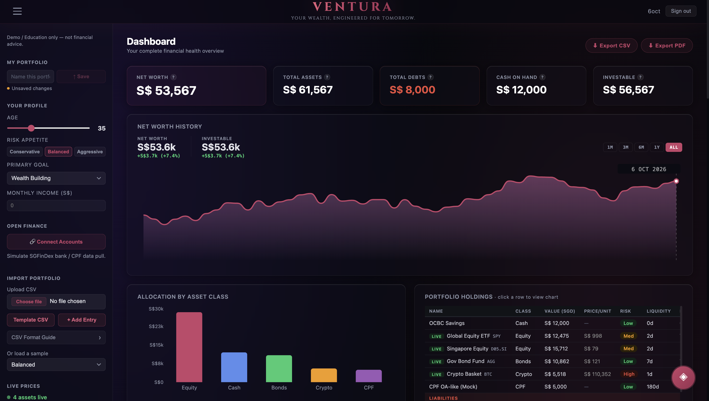
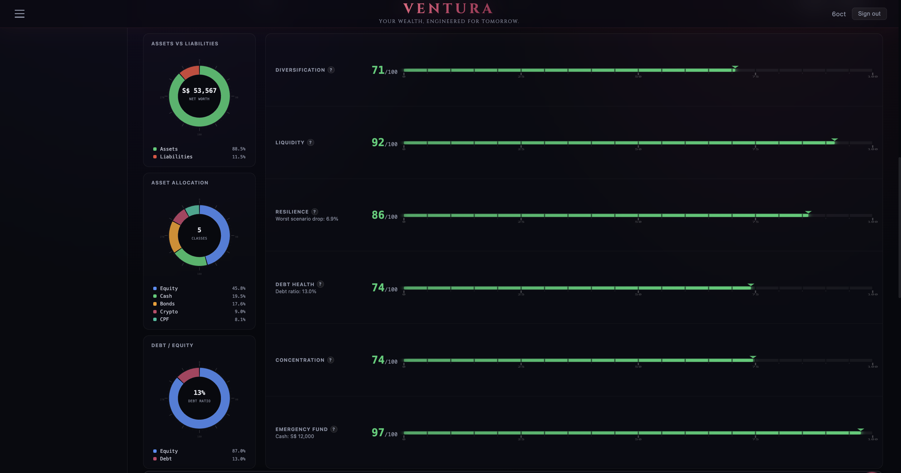
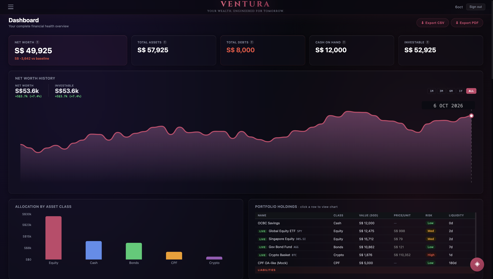
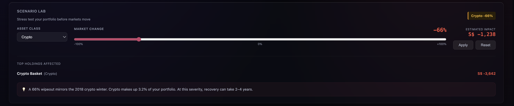
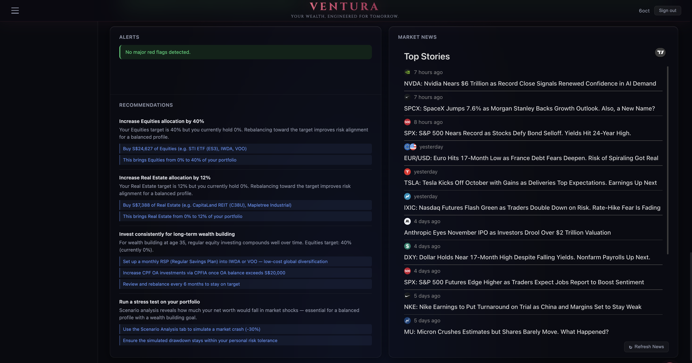

# Ventura — Your Wealth, Engineered for Tomorrow

**Team:** 404  
**Hackathon:** FinTech Innovators Hackathon 2026

Ventura is a unified financial wellness platform that consolidates fragmented wealth data into a single **Wealth Wallet** and turns it into actionable financial intelligence.

Instead of acting as just another portfolio tracker, the platform helps users understand whether their overall wealth position is actually healthy by analyzing **diversification, liquidity, and resilience** across traditional, private, and digital assets.

> Demo / educational prototype only — not financial advice.

---

## Project Description 

Ventura is an integrated platform that helps investors and advisers view their full financial position in one place. It unifies fragmented assets across cash, equities, bonds, crypto, private holdings, property, CPF, and liabilities into a single Wealth Wallet dashboard.

Our prototype goes beyond balance tracking by translating portfolio data into financial wellness analytics. It evaluates diversification, liquidity, and resilience under market stress, then generates prioritised recommendations to improve financial health. Users can sign in to save their portfolios, upload a CSV, add assets manually, refresh selected live prices, and simulate shocks such as a crypto crash or equity downturn to instantly see how their net worth and scores change — with an AI assistant on hand to explain the results in plain language.

This solves the problem statement by giving users a secure and intuitive way to understand total wealth composition, identify risks, and take proactive action. Rather than asking only “What do I own?”, Ventura helps users answer “How financially prepared am I?” — making the platform more useful for long-term planning, advisory conversations, and real-world financial decision-making.

---

## Problem Statement

Investors increasingly manage wealth across fragmented financial ecosystems, including:

- Bank accounts
- Brokerage portfolios
- Cryptocurrency wallets
- Private investments
- Property and alternative assets

Because these assets exist across multiple platforms, users often lack a clear and complete picture of their total financial health. This fragmentation makes it difficult to assess:

- Concentration risk
- Liquidity needs
- Portfolio resilience
- Overall wealth readiness

Ventura addresses this by providing a single, integrated view of wealth and translating it into actionable financial wellness insights.

---

## Our Solution

Ventura consolidates a user’s assets into a single **Wealth Wallet** and transforms raw holdings into a clear, intuitive financial wellness dashboard.

The platform allows users to:

- Aggregate traditional, private, and digital assets
- Visualize total wealth composition
- Measure financial wellness using explainable metrics
- Simulate stress scenarios and portfolio shocks
- Receive prioritised recommendations for action

This shifts wealth management from **passive tracking** to **proactive financial decision-making**.

---

## Why Ventura Is Different

Most platforms focus on tracking balances or performance within one ecosystem only. Ventura is different because it combines **asset aggregation** with **financial wellness intelligence**.

### 1. Beyond Portfolio Tracking
We do not stop at displaying balances and charts. We assess whether a portfolio is actually healthy by measuring diversification, liquidity, and resilience.

### 2. Full Wealth Visibility
The platform is designed for hybrid portfolios spanning traditional assets, private holdings, and digital assets, giving users a more complete picture of wealth than single-platform tools.

### 3. Scenario-Driven Decision Support
Users can simulate market shocks and immediately see how those events affect net worth, wellness scores, and portfolio risks.

### 4. Actionable, Not Passive
The system generates prioritised recommendations so users know what to do next, instead of simply showing static dashboards.

### 5. Financial Wellness Focus
We shift the conversation from **“What do I own?”** to **“How financially prepared and resilient am I?”**

---

## Key Features

### 1) Unified Wealth Wallet
Users can consolidate assets across categories such as:

- Cash
- Equities
- Bonds
- Crypto
- Property
- Private / alternative assets
- CPF
- Liabilities

Portfolio data can be added through CSV upload, manual entry, sample datasets, or a simulated SGFinDex bank / CPF import ("Connect Accounts"). Holdings in foreign currencies (USD, EUR, GBP, JPY and more) are converted to SGD using live FX rates.

Users have personal accounts, so named portfolios can be saved and reloaded across sessions.

### 2) Financial Wellness Analytics
The platform calculates clear, explainable metrics on a 0–100 scale. The three core scores are described below; the dashboard also tracks **Debt Health**, **Concentration** (single-holding risk), and **Emergency Fund** adequacy.

#### Diversification Score
Measures concentration risk across asset classes.

**Example insight:**  
High concentration detected in crypto assets.

#### Liquidity Score
Measures how much of the portfolio can be converted into cash quickly.

**Example insight:**  
Only 18% of portfolio is liquid within 7 days.

#### Resilience Score
Stress-test-based score measuring how the portfolio performs under simulated shocks.

**Example insight:**  
Worst-case drawdown is 21%.

### 3) Scenario Stress Testing
In **Scenario Lab**, users can shock any asset class (or the whole portfolio) by −100% to +100%, for example:

- Crypto market crash
- Equity downturn
- Bond sell-off from rising interest rates

The Resilience Score itself is based on built-in stress tests (equities −15%, crypto −30%, bonds −5%, private assets −10%).

The dashboard recalculates:

- Net worth
- Score changes
- Loss drivers
- Updated recommendations

This helps users understand portfolio resilience before real crises happen.

### 4) Actionable Recommendations
The system generates prioritised next steps based on score outputs, tailored to the user's profile (age, risk appetite, and primary goal).

Examples include:

- Reduce concentration in crypto assets
- Increase liquid reserves for short-term stability
- Rebalance towards more diversified asset classes
- Review debt burden and improve emergency reserves

For follow-up questions, a built-in AI assistant answers using the user's actual holdings, scores, and scenario results — e.g. *"Why is my resilience score low?"*

### 5) Intuitive Interactive Dashboard
The dashboard is designed to make financial health easier to understand through:

- Clear wealth breakdowns
- Visual score indicators
- Alerts and insights
- Scenario comparison views
- Interactive price charts for individual holdings (powered by TradingView), plus a live market news feed
- Simple portfolio management actions, including CSV and PDF export

---

## Example User Journey

1. User signs in, then uploads a portfolio CSV or loads a sample portfolio  
2. The platform consolidates all holdings into a single Wealth Wallet  
3. The dashboard computes diversification, liquidity, resilience, and supporting scores  
4. The user runs a scenario such as a crypto crash or equity selloff  
5. The dashboard updates net worth, risk drivers, and recommendations  
6. The user asks the AI assistant follow-up questions, then saves the portfolio and takes action

---

## Target Users

### Primary Users
- Retail investors with assets across multiple platforms
- Young professionals starting to build diversified wealth
- Crypto-active users with fragmented financial holdings
- Mass affluent users seeking a clearer financial overview

### Secondary Users
- Financial advisers
- Relationship managers
- Wealth platforms and fintech providers
- Banks looking to improve digital client engagement

---

## Market Potential

Ventura addresses a growing need for **holistic financial visibility** in an increasingly fragmented financial landscape.

As more investors hold assets across bank accounts, brokerages, digital wallets, CPF, property, and alternative investments, the demand for unified and actionable wealth monitoring tools will continue to rise.

### Market Opportunity
The platform can serve multiple segments:

- Retail investors seeking better personal financial clarity
- Advisory and wealth management firms improving client engagement
- Digital banks and fintechs embedding financial wellness into their ecosystems
- Institutions building next-generation wealth dashboards

### Commercial Potential
A production version of Ventura could support:

- B2C subscription plans for advanced analytics
- B2B2C white-label solutions for banks and wealth platforms
- Adviser dashboards for client portfolio reviews
- Premium scenario planning and personalized wealth coaching tools

This gives the solution strong long-term potential in both direct consumer and enterprise markets.

---

## Feasibility, Security, and Scalability

### Hackathon Prototype Feasibility
The current prototype is practical and demo-ready because it:

- Uses structured portfolio inputs
- Processes analytics quickly
- Delivers clear visual outputs
- Avoids dependency on sensitive user credentials for demo use

### Security Model (Demo)
For the hackathon prototype:

- Accounts use email + password; passwords are hashed with BCrypt and sessions use signed JWT tokens
- Only portfolios the user explicitly saves are stored (embedded H2 database); everything else stays in the browser session
- CSV files are parsed in memory and not stored
- No banking credentials are needed — the bank / CPF import is simulated

### Scalability Path
A production version can scale through:

- Open banking integrations
- Brokerage / wallet API integrations
- Production database (e.g. PostgreSQL) and hardened authentication
- Cloud-hosted analytics services
- Adviser-facing dashboards and enterprise deployment

---

## Business Model

A realistic commercialization pathway for Ventura includes:

### Option 1: Consumer Subscription
Freemium dashboard with paid tiers for:

- Advanced analytics
- Scenario simulation
- Wellness tracking over time
- Personalized financial recommendations

### Option 2: B2B / White-Label SaaS
Banks, fintechs, insurers, and wealth managers could embed the platform into their digital experience as a branded financial wellness layer.

### Option 3: Adviser Enablement
Financial advisers and wealth teams could use the platform as a client-facing advisory dashboard for portfolio review and planning discussions.

---

## System Architecture

```text
User
  ↓
Frontend Dashboard (React)  ── TradingView charts & news widgets
  ↓
Backend API (Spring Boot, JWT auth)
  ├── Analytics Engine
  │     ├── Portfolio Aggregation
  │     ├── Financial Wellness Scoring
  │     ├── Scenario Simulation Engine
  │     └── Recommendation Engine
  ├── AI Assistant ──────── Groq (Llama 3.3 70B)
  ├── Live Prices & FX ──── Binance · Yahoo Finance · ExchangeRate-API
  └── Saved Portfolios ──── H2 database
  ↓
Portfolio Data (CSV / Manual / Sample / Simulated bank & CPF import)
```

---

## Technology Stack

* **Frontend:** React + JavaScript (Vite)
* **Backend:** Spring Boot (Java 17), Spring Security + JWT
* **Database:** H2 (embedded) via Spring Data JPA
* **Data Processing:** Custom portfolio analytics engine
* **AI Assistant:** Groq API (Llama 3.3 70B)
* **Visualization:** Recharts, TradingView chart & news widgets
* **Market Data:** Binance (crypto), Yahoo Finance (equities / ETFs), ExchangeRate-API (FX)
* **Infrastructure (Demo):** Docker Compose (nginx + Spring Boot), or run locally

---

## Data Unification

Ventura standardizes multiple asset types into a single internal structure so they can be analyzed consistently.

Supported categories include:

* Cash
* Equity
* Bonds
* Crypto
* Property
* Private assets
* CPF
* Liabilities

This enables the platform to evaluate overall wealth health rather than isolated account balances.

---

## Demo Screenshots

### Dashboard Overview


### Financial Wellness Scores


### Scenario Stress Test



### Alerts and Recommendations


---

## Demo Account

To try the app without registering, sign in with the shared demo account:

| Email | Password |
|---|---|
| `Ventura404@gmail.com` | `password123` |

The account is created automatically the first time the backend starts. You can also register your own account from the **Create Account** tab.

---

## Demo Flow (60–90 Seconds)

1. Sign in with the demo account and load the **Balanced** sample portfolio
2. Show net worth, total assets, debts, cash on hand, and investable assets
3. Explain the financial wellness scores
4. Click a holding to open its live price chart
5. Use **Scenario Lab** to run a stress scenario such as a crypto crash
6. Show how net worth, scores, alerts, and recommendations change
7. Ask the AI assistant a follow-up question about the results
8. Switch to another sample portfolio to demonstrate a different risk profile

---

## How to Run Locally

### Prerequisites

* Java 17+
* Maven
* Node.js 18+
* A free [Groq API key](https://console.groq.com/keys) for the AI assistant

> **Tip:** Groq occasionally retires older models. In the event that the AI assistant reports `model_not_found`, simply update the `MODEL` value in `ChatService.java` (currently `llama-3.3-70b-versatile`) to any current model from your [Groq console](https://console.groq.com/docs/models).

### Backend

```bash
cd backend
export GROQ_API_KEY=your_groq_api_key
mvn spring-boot:run
```

Backend runs on:

```text
http://localhost:8080
```

### Frontend

In a second terminal:

```bash
cd frontend
npm install
npm run dev
```

Frontend runs on:

```text
http://localhost:5173
```

Start the backend first, then open the frontend and sign in with the [demo account](#demo-account) or create your own.

---

## Repository Structure

```text
Ventura-Wealth-Wellness-Hub/
├── backend/                  # Spring Boot API, analytics services, auth, AI assistant
│   ├── src/
│   ├── Dockerfile
│   └── pom.xml
├── frontend/                 # React dashboard (Vite)
│   ├── src/
│   ├── Dockerfile
│   ├── nginx.conf            # Serves the app and proxies /api to the backend
│   ├── package.json
│   └── vite.config.js
├── docs/
│   └── screenshots/          # README and pitch demo screenshots
├── docker-compose.yml        # Full-stack Docker setup
├── .gitignore
├── LICENSE
└── README.md
```

---

## Run with Docker

The easiest way to run the full app — no Java, Maven, or Node.js needed.

### Prerequisite
Install and open [Docker Desktop](https://www.docker.com/products/docker-desktop/).

### Step 1: Get the project files

```bash
git clone https://github.com/JIALE491/Ventura-Wealth-Wellness-Hub.git
cd Ventura-Wealth-Wellness-Hub
```

(Or download the ZIP from GitHub and open a terminal in the extracted folder.)

### Step 2: Start the app

```bash
GROQ_API_KEY=your_groq_api_key docker compose up --build
```

Replace `your_groq_api_key` with your [Groq API key](https://console.groq.com/keys) to power the AI assistant. The first build takes a few minutes.

### Step 3: Open the app

```text
http://localhost:3000
```

Sign in with the [demo account](#demo-account) (`Ventura404@gmail.com` / `password123`) or create your own. Accounts and saved portfolios are kept in a Docker volume, so they survive restarts.

### Stop the app

```bash
docker compose down        # add -v to also delete saved data
```

---

## Future Outlook

At the moment the bank and CPF import is simulated, so our next step is to connect Ventura to SGFinDex as well as real brokerage and crypto wallet accounts. That way users would not need to type in their holdings by hand. We also want to keep a record of net worth over time, so users can look back and see how their finances have changed from month to month.

Beyond that, we would like to help users plan for specific goals such as buying a home or retiring, and show them whether they are on track. Families could also view their finances together in one place, and financial advisers could use Ventura to review portfolios with their clients and share simple reports.

On the technical side, we plan to set up our own domain, move Ventura to the cloud with a proper production database, and tighten up security so the platform is production ready and anyone can sign up and use it.

Better hardware such as a GPU would also open up a few things for us. We could run a stronger LLM for the chatbot ourselves, which would give more accurate answers and keep financial data on our own servers instead of sending it to an outside service. We could also run thousands of simulated market scenarios at once instead of a handful of fixed shocks, which would make the stress tests and resilience score a lot more realistic. On top of that, we could train models on past market data to forecast how a portfolio might grow over the years, which would tie in well with goal planning.

---

## License

This repository is provided for educational and hackathon demonstration purposes.

MIT License.
